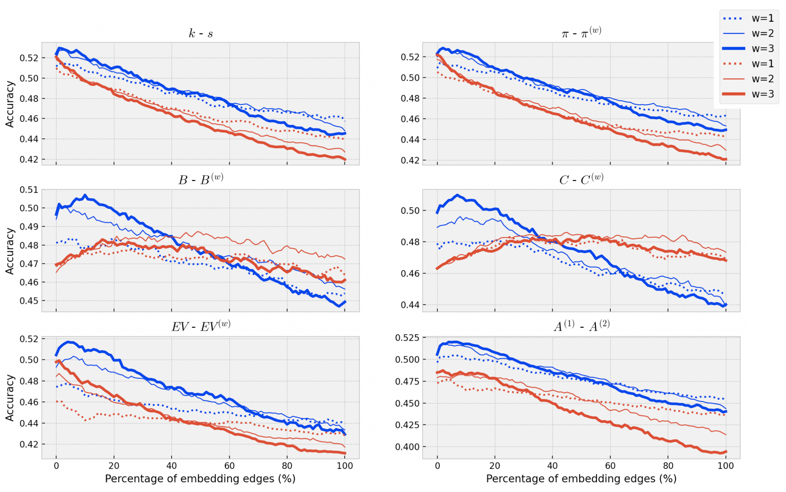
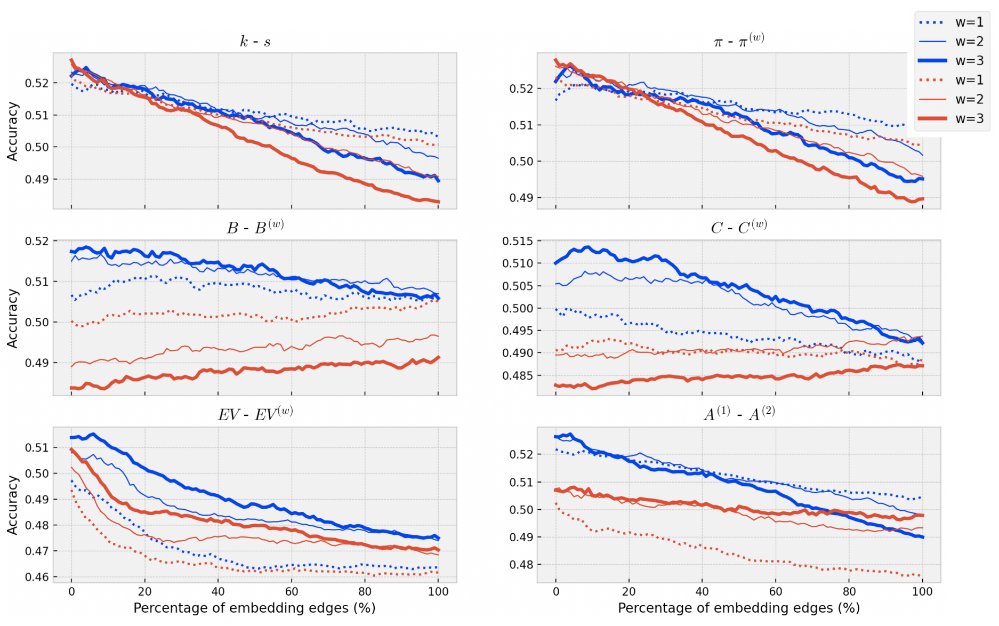
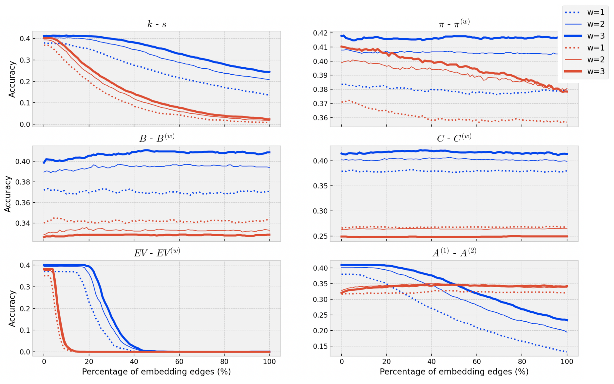

# Keyword Extraction
Keyword extraction of English texts using complex networks concepts and word embeddings. The keyword extraction task is an important NLP task in many text mining applications. Graph-based methods have been commonly used to automatically find the key concepts in texts, however, relevant information provided by embeddings has not been widely used to enrich the graph structure. Here I modeled texts co-occurrence networks, where nodes are words and edges are established either by contextual or semantical similarity. I compared two embedding approaches
(Word2vec and BERT) to check whether edges created via word embeddings can improve the quality of the keyword extraction method.

## Datasets
I used publicly available datasets including the source texts and their gold-standard
keywords defined by experts. The following datasets were chosen for their variability in size
and sources. The _Hult-2003 dataset_ contains title, keywords, and abstracts from scientific papers
published between 1998 and 2002. The documents were extracted from the Inspect
Database of Physics and Engineering papers. This dataset contains 500 abstracts as
well as the set of keywords that were assigned by human annotators. The _Marujo-2012 dataset_ comprises
450 web news stories on subjects such as business, culture, sport, and technology. Finally, I also used the _Semeval-2010 dataset_. This dataset comprises scientific papers that were extracted from the ACM Digital Library. I considered the full content of 100 papers and their corresponding keywords assigned by both authors
and readers. In the following table, I show the statistical information from datasets for the keyword extraction task. _D_ represents the number of documents. I also show the average number of tokens (_W_),
sentences (_S_) and vocabulary size (_U_). _K_ is the average number of reference keywords assigned per document.

Dataset | Description | D | W_avg | U_avg | S_avg | K_avg
|---- | ---- | --- | --- | --- |--- |--- |
| Hult-2003 | Paper abstracts | 500 | 123.12 | 73.25 | 5.14 | 18.83
| Marujo-2012 | Web news stories | 450 | 452.36 | 223.33 | 20.74 | 52.79
| SemEval-2010 | Full papers | 100 | 8168.49 |1387.47 |393.80 |23.34

## Methodology
The framework proposed to detect keywords via word embeddings and graph modeling
comprises the following four main steps: i) text pre-processing; ii) word vectorization; iii) network creation; and iv) word ranking and keyword extraction.
- **Pre-processing**: This phase comprises the required steps to conveniently pre-process the datasets. This step encompasses sentence segmentation, stopword removal and text stemming.
- **Word vectorization**: I considered the embeddings models to represent the words. The embeddings are important for identifying similar words that do not co-occur in the text.
- **Network creation**: I modeled the documents as word co-occurrence networks, where nodes represent words and edges are established based on the neighbors of each word. I also considered “virtual” edges, which were generated based on the similarity between two words. The similarity is computed based on the word vectorization. This
is an essential step for capturing long-range, semantical relationships.
- **Keyword extraction**: I used several network centrality measurements to rank the words for each document. Such measurements are used to give an importance value or relevance weight to each node from the network. The top N ranked words were considered keywords.

The workflow we considered for keyword extraction is shown in the following Figure:

 

## Main results
In the following figures I show a comparison of the performance of each centrality measurement for the three datasets Hult-2003,  Marujo-2012, and SemEval-2010.  For all subplots except the Accessibility metric, the blue lines represent unweighted measurements, while the red lines are weighted measurements. In the case of the Accessibility centrality, the blue lines describe the A(1) metric and the red lines represent the A(2) metric. We also evaluated the window length (w = {1, 2, 3}) for the network creation step: dotted lines are used when the value w = 1 is established, while thicker lines represent values for larger values of w. The goal of these figures is to analyze if the performance is improved when we vary the model parameters. We are particularly interested in the performance analysis when varying both the window length (w) and the number of virtual edges (P).  We considered distinct model parameters, with the window length being represented by different curves and P represented on the x-axis. The effect of considering edge weights was also considered.  

**Hult-2003 performance analysis:**

**Marujo-2012 performance analysis:**

**SemEval-2010 performance analysis**

## References
[Using virtual edges to extract keywords from texts modeled as complex networks](https://arxiv.org/abs/2205.02172). JAV Tohalino, TC Silva, DR Amancio. arXiv preprint arXiv:2205.02172

[Using citation networks to evaluate the impact of text length on the identification of relevant concepts](https://arxiv.org/abs/2301.06168). JAV Tohalino, TC Silva, DR Amancio. arXiv preprint arXiv:2301.06168

